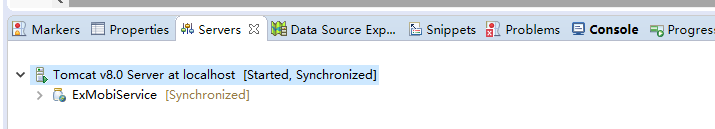
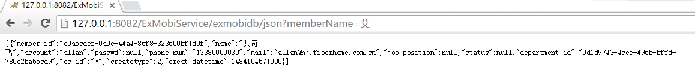
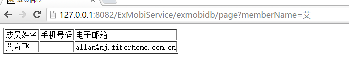
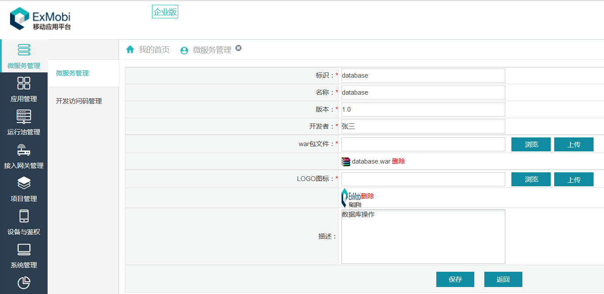
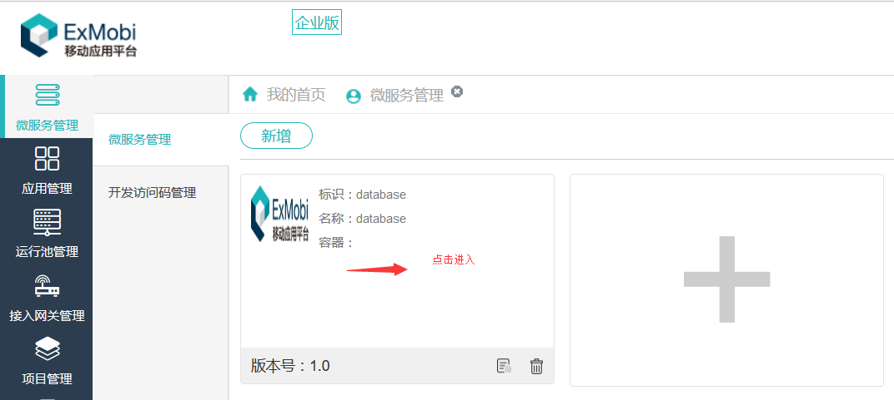
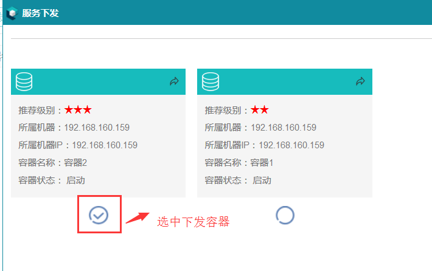
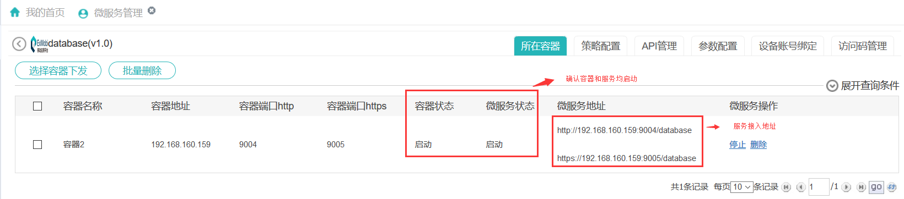
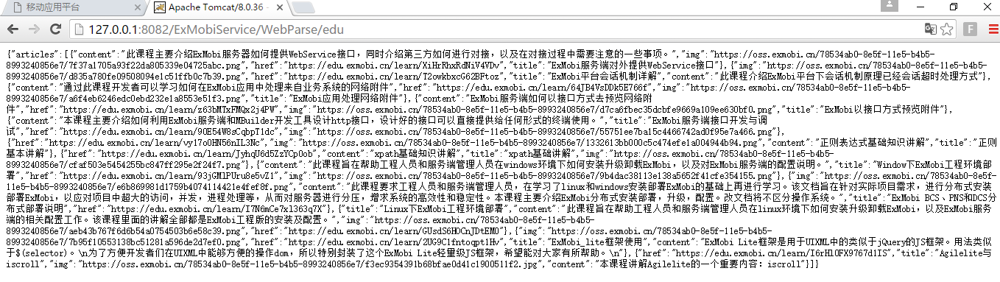

# 服务HelloWorld

----------

<h2 id="cid_0">数据库服务</h2>
<h3 id="cid_0_0">功能介绍</h3>
SSM开发模式，通过MyBatis这个持久层框架去操作数据库，但是exmobi-jar包内，本身也封装了对数据库操作的API，只不过不是面向对象的方式，所以在一些业务场景中，比较简单的SQL操作，也可以不通过MyBatis框架，直接用ExMobi6服务端jar包里的exmobi-db.jar去操作数据。下面我们就以一个实际的例子来体验下。  

本示例以集成服务API exmobi-db.jar为例，通过对应的数据库操作API对数据库进行访问操作。并提供出相应API接口供调用查询部门信息。（在[SSM环境搭建](/exmobiserver-begin/SSM.html)的工程中实现此示例，故相关配置项不再重复描述）  

<h3 id="cid_0_1">准备工作</h3>
除第六章中SSM框架搭建所需jar包外还需以下jar包：  

*  jackson-annotations-2.7.4.jar    

*  jackson-core-2.7.4.jar  

*  jackson-core-asl-1.9.13.jar  

*  jackson-databind-2.7.4.jar  

*  mchange-commons-java-0.2.3.4.jar  

*  commons-logging-1.1.1.jar  

<h3 id="cid_0_2">功能实现</h3>
<h4 id="cid_0_2_0">第一步，编写API及视图页面</h4>
编写实现API的Controller文件， 我们在com.fh.demo.controller包下建立ExMobiDbController.java文件  

```java
package com.fh.demo.controller;

import java.util.ArrayList;
import java.util.List;

import javax.annotation.Resource;
import javax.sql.DataSource;

import org.slf4j.Logger;
import org.slf4j.LoggerFactory;
import org.springframework.stereotype.Controller;
import org.springframework.ui.Model;
import org.springframework.web.bind.annotation.RequestMapping;
import org.springframework.web.bind.annotation.RequestParam;
import org.springframework.web.bind.annotation.ResponseBody;

import com.fh.demo.entity.Member;
import com.fiberhome.db.bean.TableRow;
import com.fiberhome.db.impl.DBProcessImpl;

@Controller
@RequestMapping("/exmobidb")
public class ExMobiDbController {

	private static final Logger logger= LoggerFactory.getLogger(ExMobiDbController.class);
	
	//采用注解方式引入spring-db.xml配置的数据源bean对象
	@Resource(name="dataSource")
	private DataSource ds;
	
	//返回jsp视图处理
	@RequestMapping("/page")
	public String getMembers(Model model,@RequestParam(required=false,value="memberName")String memberName) throws Exception{
		logger.info("============查询部门信息==========");
		DBProcessImpl aaa = new DBProcessImpl(ds);
		if(null != memberName && memberName.length()>0){
			model.addAttribute("customers", aaa .queryRows("SELECT * FROM tbl_member WHERE name LIKE ?", new Object[] {"%"+memberName+"%"}));
		}else{
			
			model.addAttribute("customers", aaa .queryRows("SELECT * FROM tbl_member LIMIT 10 OFFSET 0", null));
		}
		return "customer";
	}
	
	//返回json数据
	@RequestMapping("/json")
	@ResponseBody
	public Object getMembers(@RequestParam(required=false,value="memberName")String memberName) throws Exception{
		logger.info("============查询部门信息==========");
		DBProcessImpl aaa = new DBProcessImpl(ds);
		List<TableRow> members = new ArrayList<TableRow>();
		if(null != memberName && memberName.length()>0){
			members = aaa .queryRows("SELECT * FROM tbl_member WHERE name LIKE ?", new Object[] {"%"+memberName+"%"});
		}else{
			members = aaa .queryRows("SELECT * FROM tbl_member LIMIT 10 OFFSET 0", new Object[] {null});
		}
		return members;
	}
}

```

上述Api实现类，实现了两个方法，第一个方法是访问数据库得到的成员数据交给jsp页面去展现，第二个方法是直接给请求者输出成员数据的json格式。  

下面我们来实现展示页面customer.jsp,  位于Spring MVC配置文件配置指定的/WEB-INF/views/目录下  

```html
<%@ page language="java" import="java.util.*" contentType="text/html; charset=UTF-8"
    pageEncoding="UTF-8"%>
<%@ taglib prefix="c" uri="http://java.sun.com/jsp/jstl/core" %>
<!DOCTYPE html PUBLIC "-//W3C//DTD HTML 4.01 Transitional//EN" "http://www.w3.org/TR/html4/loose.dtd">
<html>
<head>
<meta http-equiv="Content-Type" content="text/html; charset=UTF-8">
<meta http-equiv="pragma" content="no-cache">
<meta http-equiv="cache-control" content="no-cache">
<meta http-equiv="expires" content="0">

<title>成员信息</title>
</head>
<body>
<table border="1">
	<thead>
		<tr>
			<td>成员姓名</td>
			<td>手机号码</td>
			<td>电子邮箱</td>
		</tr>
	</thead>
	<tbody>
		<c:forEach items="${customers}" var="var" varStatus="vs">
			<tr>
				<td>${var.name }</td>
				<td>${var.phoneNum }</td>
				<td>${var.mail }</td>
			</tr>
		</c:forEach>
	</tbody>
</table>
</body>
</html>

```

<h4 id="cid_0_2_1">第二步，本地验证功能</h4>

将工程发布到tomcat中，并启动tomcat。  

  

JSON格式数据返回：  

  

页面方式返回：  

  

<h4 id="cid_0_2_2">第三步，发布服务</h4>

下面我们要从IDE里导出开发好的war包在ExMobi6服务端发布，服务发布流程图如下：  

  

  

  

  

<h2 id="cid_1">Http请求及页面抓取示例服务</h2>
<h3 id="cid_1_0">功能介绍</h3>
本示例以集成服务API exmobi-http.jar为例，通过对应的HTTP操作API访问[ExMobi教程系统首页](https://edu.exmobi.cn/)，然后再通过exmobi-common.jar内封装的执行Xpath相关类，对网页内容进行抓取，把教程列表信息格式化成Json数据输出。（在第六章SSM环境搭建的工程中实现此示例，故相关配置项不再重复描述）  

<h3 id="cid_1_1">准备工作</h3>

准备exmobi-http.jar,exmobi-common.jar及依赖的jar  

<h3 id="cid_1_2">功能实现</h3>
<h4 id="cid_1_2_0">第一步，编写API</h4>

编写实现此API的Controller类文件，在com.fh.demo.controller包下建立“WebParseController.java”类：  

```java
package com.fh.demo.controller;


import java.util.List;

import org.apache.log4j.Logger;
import org.dom4j.Document;
import org.dom4j.Node;
import org.springframework.stereotype.Controller;
import org.springframework.web.bind.annotation.RequestMapping;
import org.springframework.web.bind.annotation.ResponseBody;

import com.alibaba.fastjson.JSONArray;
import com.alibaba.fastjson.JSONObject;
import com.fiberhome.common.suport.xpath.CachedDom4jXpathProcessImpl;
import com.fiberhome.common.suport.xpath.IXPathProcess;
import com.fiberhome.common.util.XmlUtil;
import com.fiberhome.http.bean.HttpResponseBean;
import com.fiberhome.http.impl.HttpUtil;

@Controller
@RequestMapping(value="/WebParse")
public class WebParseController {

	private static final Logger logger = Logger.getLogger(WebParseController.class);
	
	@RequestMapping("/edu")
	@ResponseBody
	public Object getEduList() throws Exception{
		HttpUtil httpUtil = new HttpUtil();
		String url = "https://edu.exmobi.cn/";
		HttpResponseBean rsp = httpUtil.sendGet(url);//发起http请求
		JSONObject rspJson = new JSONObject();
		JSONArray articlesArray = new JSONArray();
		// 获取响应吗
		int status = rsp.getStatusCode();
		if(status == 200){
			//html转Dom文件
			Document dom = XmlUtil.html2xml(rsp.getResponseBody("UTF-8"));
			IXPathProcess ixp = new CachedDom4jXpathProcessImpl();
			List<Object> articles = ixp.selectNodes("//div[@class='col-xs-6 col-md-3 edit']", dom);
			for(Object at:articles){
				Node atNode = (Node)at;
				JSONObject article = new JSONObject();
				article.put("title", ixp.selectNodeValue("./a/div/h6[1]/text()", atNode));
				article.put("content", ixp.selectNodeValue("./a/div/h6[2]/text()", atNode));
				article.put("href", ixp.selectNodeValue("./a/@href", atNode));
				article.put("img", ixp.selectNodeValue("./a/img/@src", atNode));
				articlesArray.add(article);
			}
			rspJson.put("articles", articlesArray);
		}else{
			rspJson.put("result", "fail");
			rspJson.put("msg","业务系统响应异常，请联系管理员");
		}
		return rspJson;
	}
}

```

<h4 id="cid_1_2_1">第二步，本地验证功能</h4>
将工程发布到tomcat中，并启动tomcat。  

  

JSON格式数据返回：  

  

<h4 id="cid_1_2_2">第三步，发布服务</h4>

参照[数据库服务](#cid_0)功能实现章节  