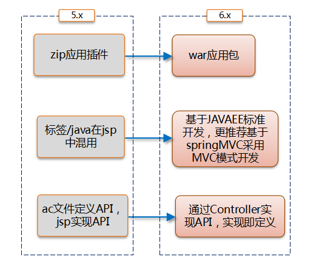
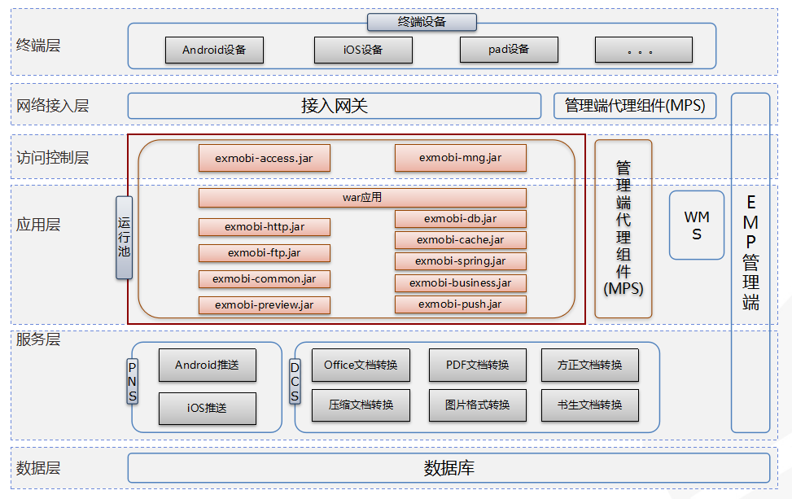
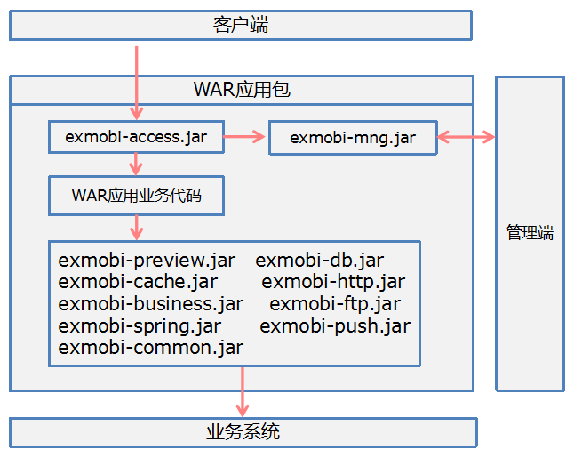
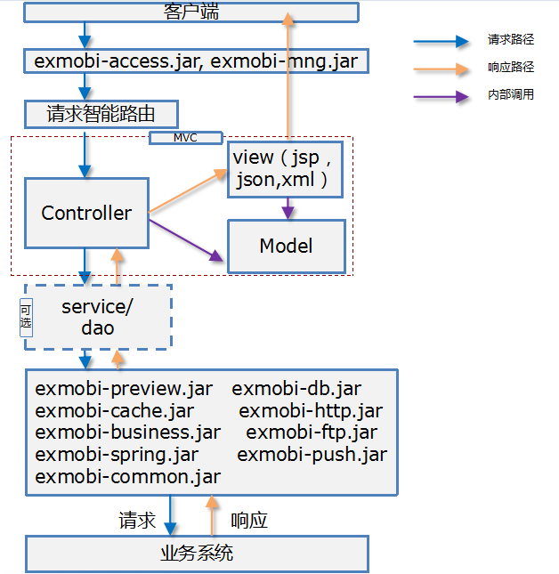

#原理和架构 

----------
<h2 id="cid_0">与ExMobi-server-5.x的区别</h2>

相比于ExMobi-server-5.x，ExMobi-server-6.x版本彻底颠覆了原来以JSP作为业务处理核心的设计思路，放弃了以mapp.xml和jsp打包的应用插件(zip格式)的开发和运维方式，取而代之的是以支持全JAVA技术的服务为核心的移动应用后端，以容器和运行池作为运行载体的全新开发和运维方式。

<h2 id="cid_1">解决了ExMobi-server-5.x哪些问题</h2>

* 解决了5.x基于jsp开发，虽然继承了java的特性，但远没有java编码灵活的问题。
* 解决了5.x基于jsp开发，代码提示、代码调试等永远是硬伤的问题。
* 解决了5.x基于jsp开发，开发者很难自定义bean对象或引入自定义库的问题。
* 解决了5.x基于jsp开发，无法实现代码分层，业务逻辑和界面展示在一起，标签和java混用，现有标签无法做二次封装的问题。
* 解决了5.x基于jsp开发，仍然捆绑着应用后端仅仅是业务系统适配器思维的问题。
* 解决了5.x client和server迫切需要解耦的问题，应用插件包结构包括client，server，mapp.xml等3部分，client和server有紧密耦合性，已无法满足现在主流的API形式的开发模式，client和server迫切需要解耦。
* 解决了5.x以jsp为开发基础的API开发形式，也无法摆脱jsp开发的各种弊端的问题。

<h2 id="cid_2">ExMobi-server-6.x架构</h2>

* 系统从终端层、网络接入层、访问控制层、应用层、服务层和数据层几个层次划分，各个功能分别分布于不同的层次。
* 网络接入层中包含接入网关和管理端代理组件。运行池中不同部分分别分布于访问控制层和应用层。
* 访问控制层，主要包含exmobi-access.jar，exmobi-mng.jar，负责服务接入的访问控制。
* 应用层，是服务运行的主要环境，是实际业务执行的逻辑位置。
* 服务层，原PNS和DNS分别作为服务，运行在服务层。
* 数据层，是平台层面数据库数据存储位置。

应用层各jar包使用说明请参照后面的服务开发章节。

<h2 id="cid_3">服务的构成</h2>

服务的主体仍然是web应用业务本身，同时ExMobi-server推出了ExMobi-*.jar，提供给服务调用，ExMobi-*.jar提供的API主要分为运维管控API和业务开发API两大类。其中运维管控API包括 exmobi-access.jar、 exmobi-mng.jar和exmobi-business.jar，主要负责搭建服务与管理端的通信通道、与管理端交互、定义通信接口、接入控制、应用访问服务鉴权、设备注册、设备绑定、服务访问记录上报、服务参数查询功能等；业务开发API包括exmobi-common.jar、exmobi-db-.jar、exmobi-ftp.jar、exmobi-http.jar、exmobi-push.jar、exmobi-preview.jar和exmobi-spring.jar，用于供应用业务代码调用，主要负责服务HTTP抓取、DB操作、FTP操作、推送、附件预览和基础工具集函数。

<h2 id="cid_4">基于SpringMVC开发的服务运行原理</h2>

ExMobi推荐应用开发者使用SpringMVC作为web开发框架开发服务，其优雅的设计和完善的注解功能，非常适合各阶段水平的开发者使用，SpringMVC的注解功能，可以非常简单的定义一个HTTP接口API，同时支持RESTFUL风格的API。

如上图所示，用户的请求首先经过exmobi-access.jar，经过接入鉴权后，会智能路由的指定的Controller中，由Controller调用service/dao层，通过service/dao层调用exmobi-*.jar，或者Controller直接调用exmobi-*.jar，获得到业务数据并构建model层对象，最终通过view层展示。而这个过程中，一个Controller就是一个HTTP接口API，开发者可以定义任意多个Controller实现不同的业务逻辑。

<h2 id="cid_5">运维管控API实现原理</h2>

运维管控API包括 exmobi-access.jar、 exmobi-mng.jar和exmobi-business.jar，主要负责搭建服务与管理端的通信通道、与管理端交互、定义通信接口、接入控制、应用访问服务鉴权、设备注册、设备绑定、服务访问记录上报、服务参数查询功能等。

用户的请求首先经过exmobi-access.jar，触发相关访问控制功能的拦截器或过滤器，拦截器或过滤器中，会调用exmobi-mng.jar，与管理端通信，与管理端交互，拦截器或过滤器根据管理端界面的相关配置和设置，实时产生不同的控制效果，并返回控制结果，exmobi-access.jar接收到控制结果，执行相应的动作，如果访问控制流程全部通过，请求才真正执行到应用实际的业务逻辑。