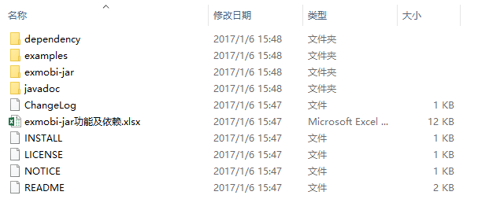
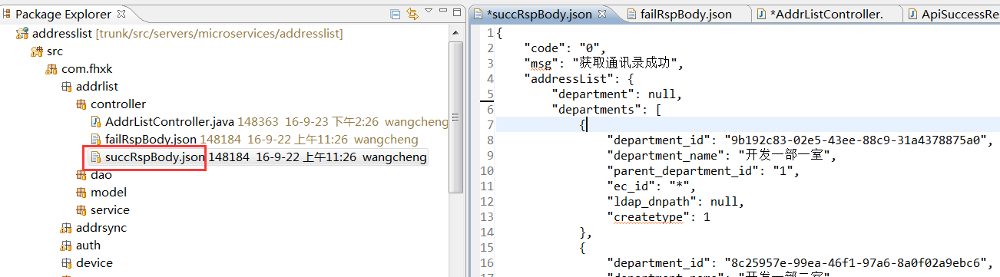
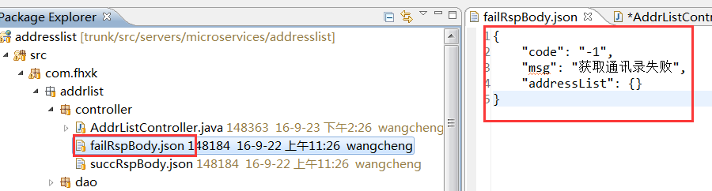

# 服务开发API 

----------
<h2 id="cid_0">exmobi-jar获取地址及目录介绍</h2>  

开发者可访问[exmobi6-server-jar](https://www.exmobi.cn/resource/download/info/a8ca50e0-19d1-11e7-964b-c5cc0053fda0.do)此地址下载Exmobi6服务端的jar包以及示例代码、javadoc、所依赖的jar包。

下载下来是个zip包，解压后目录结构如下：

  

其中“exmobi-jar”目录下即为本章节后面介绍的各个功能jar包，“exmobi-jar功能及依赖.xlsx”文档里列出了各个exmobi-jar包所依赖的第三方jar包，而“dependency”目录里就是所有的依赖第三方包，“javadoc”为exmobi-jar包内封装的各方法的API文档，“example”目录里为各jar包的示例代码。

下面为各个exmobi-jar包功能简介：

> exmobi-access.jar——负责接入控制，其中包含一系列功能拦截器，实现在应用执行前执行拦截业务，需调用exmobi-mng.jar  
> exmobi-business.jar——应用升级版本查询、设备绑定、服务参数查询功能，需调用exmobi-mng.jar  
> exmobi-common.jar——常用工具集函数，包括文件操作、日期操作、json、xpath、base64、签批、水印、xml、zip、unicode和md5等  
> exmobi-db-.jar——提供数据库常用的增,删,改,查及存储过程的操作，完整的封装了DB操作，支持连接池，调用者无需关心连接释放等问题，轻松调用数据库  
> exmobi-ftp.jar——提供对ftp服务器的文件操作工具类  
> exmobi-http.jar——提供对第三方web系统进行http协议数据交换，简单了非常简单的网络请求方法，包括sendGet，sendPost，sendCustomPostContent和sendMultipart  
> exmobi-push.jar——提供消息推送客户端程序，用于对接PNS服务  
> exmobi-preview.jar——提供附件预览客户端程序，用于对接DCS服务  
> exmobi-mng.jar——负责与管理端交互，搭建管理端与服务的通信通道，定义通信接口  
> exmobi-spring.jar——提供一套用于定义API的注解，引入这个包，还可以支持基于SpringMVC开发的服务的API信息自动抽取和展示  


<h2 id="cid_1">exmobi-http.jar</h2>  

<h3 id="cid_1_0">功能介绍</h3>  

HTTP协议操作API能力提供，主要提供支持发送HTTP/HTTPS请求及相应的处理API。

<h3 id="cid_1_1">库依赖</h3>  

*  公共jar  

> commons-logging-1.1.1.jar  
> slf4j-api-1.6.2.jar  
> slf4j-log4j12-1.6.2.jar  
> log4j-1.2.16.jar    

*  其他jar  

> exmobi-cache-1.0.0.jar  
> httpcore-4.1.1.jar  
> httpmime-4.1.1.jar  
> httpclient-4.1.1.jar  
> commons-codec-1.4.jar  

<h3 id="cid_1_2">主要API</h3>  

<table>
<tr>
  <td>类</td>
  <td>描述</td>
  <td>兼容性</td>
</tr>
<tr>
  <td>com.fiberhome.http.HttpUtilBase</td>
  <td>基于http协议的网络数据获取抽象类</td>
  <td>6.0+</td>
</tr>
<tr>
  <td>com.fiberhome.http.impl.HttpUtil</td>
  <td>基于http协议的网络数据获取， url进行默认编码处理。</td>
  <td>6.0+</td>
</tr>
<tr>
  <td>com.fiberhome.http.impl.HttpUtilWithOutEncode</td>
  <td>基于http协议的网络数据获取，url不进行编码处理。</td>
  <td>6.0+</td>
</tr>
<tr>
  <td>com.fiberhome.http.bean.AttachFile</td>
  <td>附件封装类</td>
  <td>6.0+</td>
</tr>
<tr>
  <td>com.fiberhome.http.bean.FormParamter</td>
  <td>表单封装类</td>
  <td>6.0+</td>
</tr>
<tr>
  <td>com.fiberhome.http.bean.HttpContext</td>
  <td>WEB请求上下文</td>
  <td>6.0+</td>
</tr>
<tr>
  <td>com.fiberhome.http.bean.HttpCookie</td>
  <td>Cookie封装类</td>
  <td>6.0+</td>
</tr>
<tr>
  <td>com.fiberhome.http.bean.HttpHeader</td>
  <td>请求头封装类</td>
  <td>6.0+</td>
</tr>
<tr>
  <td>com.fiberhome.http.bean.HttpRequestBean</td>
  <td>请求信息封装类</td>
  <td>6.0+</td>
</tr>
<tr>
  <td>com.fiberhome.http.bean.HttpResponseBean</td>
  <td>响应信息封装类</td>
  <td>6.0+</td>
</tr>
<tr>
  <td>com.fiberhome.http.bean.ProxyBean</td>
  <td>代理封装类</td>
  <td>6.0+</td>
</tr>
</table>

<h3 id="cid_1_3">示例</h3>  

HTTP功能API调用代码片段  

```java
@Test
public void nomarReq1() throws Exception
{
	HttpUtil httputil = new HttpUtil();

	HttpResponseBean rsp = httputil.sendGet("http://www.baidu.com");

	// 获取响应吗
	Int status = rsp.getStatusCode();

	// 获取响应头
	List<HttpHeader>rspheaders = rsp.getHeaders();

	// 获取响应类容
	String data = rsp.getResponseBody("utf-8");

	System.out.println(status);
	System.out.println(rspheaders);
	System.out.println(data);
}

```

<h3 id="cid_1_4">更多</h3>  

见javadoc及example内示例  

<h2 id="cid_2">exmobi-db.jar</h2>  

<h3 id="cid_2_0">功能介绍</h3>  

数据库操作API能力提供，主要提供数据库的查询，修改及存储过程调用操作API。  

<h3 id="cid_2_1">库依赖</h3>  

*  公共jar  
 
> commons-logging-1.1.1.jar  
> slf4j-api-1.6.2.jar  
> slf4j-log4j12-1.6.2.jar  
> log4j-1.2.16.jar  

<h3 id="cid_2_2">主要API</h3>  

<table>
<tr>
  <td>类</td>
  <td>描述</td>
  <td>兼容性</td>
</tr>
<tr>
  <td>com.fiberhome.db.IDbProcess</td>
  <td>数据库操作接口</td>
  <td>6.0+</td>
</tr>
<tr>
  <td>com.fiberhome.db.impl.DBProcessImpl</td>
  <td>数据库操作实现，主要提供查询，更新及存储过程的操作。</td>
  <td>6.0+</td>
</tr>
<tr>
  <td>com.fiberhome.db.bean.TableRow</td>
  <td>数据库单行记录</td>
  <td>6.0+</td>
</tr>
<tr>
  <td>com.fiberhome.db.bean.CallResult</td>
  <td>存储过程调用结果</td>
  <td>6.0+</td>
</tr>
</table>

<h3 id="cid_2_3">示例</h3>  

```java
@Test
public void testQueryRow() throws Exception
{
	// 获取数据源
	DataSource ds = getDataSource();

	// 示例db执行类
	IDbProcess dbp = new DBProcessImpl(ds);

	// 执行查询
	TableRow tr = dbp.queryRow("select * from tbl_dept where id=? ", new Object[]
	{
		"1"
	});

	System.out.println(tr);
}
```

<h3 id="cid_2_4">更多</h3>  

见javadoc及example内示例  

<h2 id="cid_3">exmobi-common.jar</h2>  

<h3 id="cid_3_0">功能介绍</h3>  

公共API，主要提供BASE64，MD5，UNICODE,文件读写，JSON,水印，签批，weboffice，ldap，xpath，xml，zip操作API。  

<h3 id="cid_3_1">库依赖</h3>  

*  公共jar  

> commons-logging-1.1.1.jar  
> slf4j-api-1.6.2.jar  
> slf4j-log4j12-1.6.2.jar  
> log4j-1.2.16.jar   

*  其他jar

> xercesImpl-2.11.0-FH.jar  
> commons-codec-1.9.jar  
> ant-launcher-1.8.3.jar  
> ant-1.8.3.jar  
> json-1.0.jar  
> jackson-mapper-asl-1.9.13.jar  
> jackson-core-asl-1.9.13.jar  
> nekohtml-1.9.9.jar  
> dom4j-1.6.1.jar  
> jaxen-1.1.1.jar  
> itext-2.1.7.jar  
> saxon-9.1.0.8.jar  
> saxon-9.1.0.8-dom.jar  

<h3 id="cid_3_2">主要API</h3>  

<table>
<tr>
  <td>类</td>
  <td>描述</td>
  <td>兼容性</td>
</tr>
<tr>
  <td>com.fiberhome.common.util.Base64Util</td>
  <td>base64操作功能</td>
  <td>6.0+</td>
</tr>
<tr>
  <td>com.fiberhome.common.util.DateUtil</td>
  <td>日期操作</td>
  <td>6.0+</td>
</tr>
<tr>
  <td>com.fiberhome.common.util.IoUtil</td>
  <td>IO读写操作</td>
  <td>6.0+</td>
</tr>
<tr>
  <td>com.fiberhome.common.util.JsonUtil</td>
  <td>JSON操作</td>
  <td>6.0+</td>
</tr>
<tr>
  <td>com.fiberhome.common.util.LdapUtil</td>
  <td>LDAP鉴权操作</td>
  <td>6.0+</td>
</tr>
<tr>
  <td>com.fiberhome.common.util.Md5Util</td>
  <td>MD5加密</td>
  <td>6.0+</td>
</tr>
<tr>
  <td>com.fiberhome.common.util.SignatureUtil</td>
  <td>签批操作</td>
  <td>6.0+</td>
</tr>
<tr>
  <td>com.fiberhome.common.util.UnicodeUtil</td>
  <td>UNICODE与字符串转换</td>
  <td>6.0+</td>
</tr>
<tr>
  <td>com.fiberhome.common.util.WaterMarkUtil</td>
  <td>水印操作</td>
  <td>6.0+</td>
</tr>
<tr>
  <td>com.fiberhome.common.util.WebOfficeUtil</td>
  <td>WEBOFFICE操作</td>
  <td>6.0+</td>
</tr>
<tr>
  <td>com.fiberhome.common.util.XmlUtil</td>
  <td>XML操作</td>
  <td>6.0+</td>
</tr>
<tr>
  <td>com.fiberhome.common.util.XpathUtil</td>
  <td>XPATH操作</td>
  <td>6.0+</td>
</tr>
<tr>
  <td>com.fiberhome.common.util.ZipUtil</td>
  <td>ZIP压缩/解压</td>
  <td>6.0+</td>
</tr>

</table>

<h3 id="cid_3_3">示例</h3>  

```java
@Test
public void testToSignature()
{
	try
	{
		//签批功能
		//待签批的pdf文件地址
		String signaturepdfaddr =  TestPath.getTestResourcesDir()+ "/signaturepdf.pdf";
		//待签批的jpg图片文件地址
		String signaturepageimgaddr = TestPath.getTestResourcesDir()+ "/signaturepage.jpg";  
		//用于签批的jpg图片文件地址
		String signatureimgaddr = TestPath.getTestResourcesDir()+ "/signatureimg.jpg";
		//FileSignatureBean相关属性设置见其API介绍
		FileSignatureBean fileSignatureBean = new FileSignatureBean();
		fileSignatureBean.setSignaturepdfaddr(signaturepdfaddr);
		fileSignatureBean.setSignaturepageimgaddr(signaturepageimgaddr);
		fileSignatureBean.setSignatureimgaddr(signatureimgaddr);
		fileSignatureBean.setPageNum(1);
		FileSignatureResult result = SignatureUtil.toSignature(fileSignatureBean);
		if (null != result)
		{
			//签批后的pdf文件地址
			System.out.println(result.getSignaturePdfPath());
			//签批后的图片文件地址
			System.out.println(result.getSignatureImgPath());
		}
	}
	catch (Exception e)
	{
		e.printStackTrace();
	}
}
```

<h3 id="cid_3_4">更多</h3>  

见javadoc及example示例。

<h2 id="cid_4">exmobi-push.jar</h2>  

<h3 id="cid_4_0">功能介绍</h3>  

推送API，主要提供消息推送到终端设备API  

<h3 id="cid_4_1">库依赖</h3>  

*  公共jar

> commons-logging-1.1.1.jar  
> slf4j-api-1.6.2.jar  
> slf4j-log4j12-1.6.2.jar  
> log4j-1.2.16.jar  

*  其他jar  

> dom4j-1.6.1.jar  
> jaxen-1.1.1.jar  
> xml-apis-1.3.02.jar  

<h3 id="cid_4_2">主要API</h3>  

<table>
<tr>
  <td>类</td>
  <td>描述</td>
  <td>兼容性</td>
</tr>
<tr>
  <td>com.fiberhome.push.PnsPushManager</td>
  <td>推送API，提供推送能力</td>
  <td>6.0+</td>
</tr>
<tr>
  <td>com.fiberhome.push.bean.PushMessageRequest</td>
  <td>推送请求</td>
  <td>6.0+</td>
</tr>
<tr>
  <td>com.fiberhome.push.bean.PushMessageResponse</td>
  <td>推送响应</td>
  <td>6.0+</td>
</tr>
<tr>
  <td>com.fiberhome.push.bean.GetPushStatusRequest</td>
  <td>获取推送状态请求</td>
  <td>6.0+</td>
</tr>
<tr>
  <td>com.fiberhome.push.bean.GetPushStatusResponse</td>
  <td>获取推送状态响应</td>
  <td>6.0+</td>
</tr>
<tr>
  <td>com.fiberhome.push.bean.DeliveryInformation</td>
  <td>状态报告体</td>
  <td>6.0+</td>
</tr>
</table>

<h3 id="cid_4_3">示例</h3>  
  
```java
public static void main(String[] args)
{
PnsPushManager pnsPushManager = new PnsPushManager();
pnsPushManager.setPnsServiceUrl("http://192.168.160.79:8001/services/pnsService");
PushMessageRequest pushRequestBean = new PushMessageRequest();
// 设置应用
pushRequestBean.setApplicationId("gaeaclient-android-000004");
// 设置推送目标集合
List<String>destAddr = new ArrayList<String>();
destAddr.add("esn:1");
destAddr.add("esn:2");
destAddr.add("esn:3");
pushRequestBean.setDestAddr(destAddr);
// 设置状态报告回调地址
pushRequestBean.setNotifyUrl(null);
// 设置内容
pushRequestBean.setMsgContent("{\"titlehead\": \"标题\",\"title\": \"推送消息\"}");
// 设置消息类型
pushRequestBean.setType("app");
// 设置消息标题
pushRequestBean.setTitle("您有新消息");
pushRequestBean.setCheckkey("bcs");
try
{
	PushMessageResponse pushMessageResponse = pnsPushManager.pushMessage(pushRequestBean);
	if (pushMessageResponse != null)
	{
		System.out.println(pushMessageResponse.getResult() + "=======" + pushMessageResponse.getMsg());
	try
	{
		Thread.sleep(2000);
		GetPushStatusRequest getPushStatusRequestBean = new GetPushStatusRequest();
		// 设置推送标识
		getPushStatusRequestBean.setRequestIdentifier(pushMessageResponse.getRequestIdentifier());
		// 获取推送结果
		GetPushStatusResponse getPushStatusResponseBean = pnsPushManager
				.getPushStatus(getPushStatusRequestBean);
		System.out.println("获取推送结果响应：" + getPushStatusResponseBean.getDeliveryStatusList().toString());
				}
				catch (Exception e)
				{
					e.printStackTrace();
				}
			}
		}
		catch (Exception e)
		{
			e.printStackTrace();
		}
	}

}

```

<h3 id="cid_4_4">更多</h3>  

见javadoc及example示例。

<h2 id="cid_5">exmobi-preview.jar</h2>  

<h3 id="cid_5_0">功能介绍</h3>  

文档预览API，提供文件转换成HTML或图片相关API  

<h3 id="cid_5_1">库依赖</h3>  

*  公共jar  

> commons-logging-1.1.1.jar  
> slf4j-api-1.6.2.jar  
> slf4j-log4j12-1.6.2.jar  
> log4j-1.2.16.jar  

*  其他jar  

> jaxen-1.1.1.jar  
> xml-apis-1.3.02.jar
> ant-launcher-1.8.3.jar  
> ant-1.8.3.jar  
> json-20090211.jar  
> commons-codec-1.4.jar  
> dom4j-1.6.1.jar  

<h3 id="cid_5_2">主要API</h3>  

<table>
<tr>
  <td>类</td>
  <td>描述</td>
  <td>兼容性</td>
</tr>
<tr>
  <td>com.fiberhome.preview.FileToHtml</td>
  <td>文档转换成html，以html形式返回源文档转换后的各个分页</td>
  <td>6.0+</td>
</tr>
<tr>
  <td>com.fiberhome.preview.FileToImage</td>
  <td>文档转换成图片，以图片形式返回源文档转换后的各个分页</td>
  <td>6.0+</td>
</tr>
<tr>
  <td>com.fiberhome.preview.bean.DocConvertParam</td>
  <td>文档转换参数</td>
  <td>6.0+</td>
</tr>
<tr>
  <td>com.fiberhome.preview.bean.FilePreviewResult</td>
  <td>文档转换结果</td>
  <td>6.0+</td>
</tr>
<tr>
  <td>com.fiberhome.preview.bean.FileDataBean</td>
  <td>文件对象</td>
  <td>6.0+</td>
</tr>
</table>

<h3 id="cid_5_3">示例</h3>    

```java
public static void main(String[] args)
{
	FileToHtml fileToHtml = new FileToHtml("http://192.168.160.79:8001/services/dcsService/");
	FilePreviewResult result = null;
	DocConvertParam docConvertParam = new DocConvertParam();
	docConvertParam.setPageNum(2);
	docConvertParam.setSrcFileExt("docx");
	result = fileToHtml.convertToHtml(TestPath.getTestResourcesDir()+"/temp.docx", docConvertParam);
	String convertResult = result.getResult();
	String convertMsg = result.getMsg();
	String convertIdentifier = result.getConvertIdentifier();
	String fileMd5 = result.getFileMd5();
	Int totalPageNum = result.getTotalPageNum();
	int currentPageNum = result.getCurrentPageNum();
	System.out.println(convertResult + "=====" + convertMsg + "=====" + convertIdentifier + "=====" + fileMd5
			+ "=====" + totalPageNum + "=====" + currentPageNum);
	try
	{
		List<FileDataBean>list = fileToHtml.getFilesFromFilePreviewResult(result);
		if(list != null)
		{
			for(FileDataBean fileDataBean : list)
			{
				System.out.println(fileDataBean.getDataFilePath());
			}
		}
	}
	catch (Exception e)
	{
		e.printStackTrace();
	}
	
}

```

<h3 id="cid_5_4">更多</h3>  

见javadoc及example示例。  

<h2 id="cid_6">exmobi-access.jar</h2>  

<h3 id="cid_6_0">功能介绍</h3>  

接入处理API，提供单独登录校验，设备信息采集，服务访问鉴权API。  

<h3 id="cid_6_1">库依赖</h3>  

*  公共jar  

> commons-logging-1.1.1.jar  
> slf4j-api-1.6.2.jar  
> slf4j-log4j12-1.6.2.jar  
> log4j-1.2.16.jar  

*  其他jar  

> exmobi-cache-1.0.0.jar  
> exmobi-mng-1.0.0jar  
> management-ms-6.0.0.jar  
> commons-beanutils-1.8.0.jar  

<h3 id="cid_6_2">主要API</h3>  

<table>
<tr>
  <td>类</td>
  <td>描述</td>
  <td>兼容性</td>
</tr>
<tr>
  <td>com.fiberhome.access.trustwebchecker.TrustWebChecker</td>
  <td>服务页面访问授信校验</td>
  <td>6.0+</td>
</tr>
<tr>
  <td>com.fiberhome.access.registerdevice.RegisterDevice</td>
  <td>设备信息采集上报</td>
  <td>6.0+</td>
</tr>
<tr>
  <td>com.fiberhome.access.registerdevice.RegisterDeviceFilter</td>
  <td>设备信息采集上报过滤器</td>
  <td>6.0+</td>
</tr>
<tr>
  <td>com.fiberhome.access.checkservicetoken.CheckServiceTokenFilter</td>
  <td>服务访问token鉴权过滤器</td>
  <td>6.0+</td>
</tr>
<tr>
  <td>com.fiberhome.access.checkservicetoken.CheckServiceToken</td>
  <td>服务访问token鉴权</td>
  <td>6.0+</td>
</tr>
<tr>
  <td>com.fiberhome.access.checkservicetoken.ServiceTokenCheckResult</td>
  <td>服务访问token鉴权结果</td>
  <td>6.0+</td>
</tr>
</table>

<h3 id="cid_6_3">示例</h3>    

```xml
<!—web.xml配置该过滤器，引入设备信息采集能力 -->
<filter>
	<filter-name>RegisterDeviceFilter</filter-name>
	<filter-class>com.fiberhome.access.registerdevice.RegisterDeviceFilter</filter-class>
</filter>
<filter-mapping>
	<filter-name>RegisterDeviceFilter</filter-name>
	<url-pattern>/</url-pattern>
</filter-mapping>

```

<h3 id="cid_6_4">更多</h3>  

见javadoc及example示例。

<h2 id="cid_7">exmobi-business.jar</h2>  

<h3 id="cid_7_0">功能介绍</h3>  

业务处理API，提供应用升级版本查询，设备绑定，服务参数配置获取功能。  

<h3 id="cid_7_1">库依赖</h3>  

*  公共jar  

> commons-logging-1.1.1.jar  
> slf4j-api-1.6.2.jar  
> slf4j-log4j12-1.6.2.jar  
> log4j-1.2.16.jar  

*  其他jar  

> exmobi-mng-1.0.0jar  
> management-ms-6.0.0.jar  

<h3 id="cid_7_2">主要API</h3>  

<table>
<tr>
  <td>类</td>
  <td>描述</td>
  <td>兼容性</td>
</tr>
<tr>
  <td>com.fiberhome.business.appmanage.AppManager</td>
  <td>应用升级版本查询</td>
  <td>6.0+</td>
</tr>
<tr>
  <td>com.fiberhome.business.appmanage.AppInfo</td>
  <td>应用信息</td>
  <td>6.0+</td>
</tr>
<tr>
  <td>com.fiberhome.business.devicebind.DeviceBindManager</td>
  <td>设备绑定</td>
  <td>6.0+</td>
</tr>
<tr>
  <td>com.fiberhome.business.paramconfig.ParamConfig</td>
  <td>获取服务参数</td>
  <td>6.0+</td>
</tr>
</table>

<h3 id="cid_7_3">示例</h3>  

```java
public AppInfo testQueryLatestApp()
{
	//应用升级版本查询
	String appPackage = "com.fiberhome.gaea.client";
	String version = "5.13.1.0 ";
	String esn = "98764563120";
	String imsi = "ffffffffffff";
	AppInfo appInfo = AppManager.queryLatestApp(appPackage, version, esn, imsi);
	if(appInfo==null)
	{//查询失败  返回当前版本
		appInfo = new AppInfo();
		appInfo.setAppPackage(appPackage);
		appInfo.setAppVersion(version);
	}
	return appInfo;
}

```

<h3 id="cid_7_4">更多</h3>  

见javadoc及example示例。

<h2 id="cid_8">exmobi-mng.jar</h2>  

<h3 id="cid_8_0">功能介绍</h3>  

通信能力API，辅助其他API与管理端进行通信。开发者只需要在web.xml中引入对应的MngListener即可。

<h3 id="cid_8_1">库依赖</h3>  

*  公共jar  

> commons-logging-1.1.1.jar  
> slf4j-api-1.6.2.jar  
> slf4j-log4j12-1.6.2.jar  
> log4j-1.2.16.jar    

*  其他jar  

> management-common-5.3.0.jar  
> management-ms-6.0.0.jar  
> core-2.0.7.jar  
> integration-beans-2.0.7.jar  
> hessian-4.0.7.jar  
> commons-cli-1.2.jar  
> commons-io-2.0.1.jar  
> jyaml-1.3.jar  
> json-1.0.jar  

<h3 id="cid_8_2">主要API</h3>  

<table>
<tr>
  <td>类</td>
  <td>描述</td>
  <td>兼容性</td>
</tr>
<tr>
  <td>com.fiberhome.commons.listener.MngListener</td>
  <td>初始化服务与管理端通信能力</td>
  <td>6.0+</td>
</tr>
</table>

<h3 id="cid_8_3">示例</h3>  

```xml
<listener>		
<listener-class>com.fiberhome.commons.listener.MngListener</listener-class>
</listener>

```
<h2 id="cid_9">exmobi-spring.jar</h2>  

<h3 id="cid_9_0">功能介绍</h3>  

Exmobi-spring.jar是ExMobi提供的用于让服务与SpringMVC相结合的开发包，基于SpringMVC开发的服务，建议引用该包文件。  

Exmobi-spring.jar主要包含API定义注解和API抽取逻辑两部分。API定义注解，帮助开发者更清晰的定义API的结构，包括请求体、正确响应示例、错误响应示例、API描述等。API抽取逻辑是ExMobi管理调用的逻辑，通过API抽取逻辑，管理端可以自动化将开发者基于SpringMVC开发的服务中的API定义展示到管理端中，方便API的管理、调试和传播。  

<h3 id="cid_9_1">库依赖</h3>  

*  公共jar  

> commons-logging-1.1.1.jar  
> slf4j-api-1.6.2.jar  
> slf4j-log4j12-1.6.2.jar  
> log4j-1.2.16.jar  

*  其他jar

> management-common-5.3.0.jar  
> management-ms-6.0.0.jar   
 
Spring相关依赖库，由于不同服务使用Spring的版本可能不同，仅做名称列举，建议使用4.2.6.RELEASE以上版本 ,主要包括  

> spring-webmvc.jar  
> spring-beans.jar  
> spring-context.jar  
> spring-aop.jar  
> spring-core.jar  
> spring-expression.jar  
> spring-web.jar  

<h3 id="cid_9_2">主要API</h3>  

<table>
<tr>
  <td>类</td>
  <td>描述</td>
  <td>兼容性</td>
</tr>
<tr>
  <td>com.fiberhome.spring.annotate.api.ApiRequestBody</td>
  <td>API请求体示例注解</td>
  <td>6.0+</td>
</tr>
<tr>
  <td>com.fiberhome.spring.annotate.api.ApiSuccessResponseBody</td>
  <td>API正确响应体示例注解</td>
  <td>6.0+</td>
</tr>
<tr>
  <td>com.fiberhome.spring.annotate.api.ApiFailResponseBody</td>
  <td>API错误响应体示例注解</td>
  <td>6.0+</td>
</tr>
<tr>
  <td>com.fiberhome.spring.annotate.api.ApiDescription</td>
  <td>API描述信息注解</td>
  <td>6.0+</td>
</tr>
</table>

<h3 id="cid_9_3">示例</h3>  

* 示例一：注解API的使用    

```java
/**
 * 通过@Controller注解定义当前类为控制器
 * 通过@RequestMapping注解定义了该控制器的访问映射地址是/account
 */
@RestController
@RequestMapping("/addrlist")
public class AddrListController {
	private static Logger log = Logger.getLogger(AddrListController.class);
	
	/**
	 * http://127.0.0.1:8001/addresslist/addrlist/getaddrlist.do?departmentid=1
	 */
	@RequestMapping("/getaddrlist")
	@ApiRequestBody(exampleValue="departmentid=1")
	@ApiSuccessResponseBody(exampleFile="succRspBody.json")
	@ApiFailResponseBody(exampleFile="failRspBody.json")
	@ApiDescription("根据部门id获取通讯录信息")
	public AddrListResponse getaddrlist(@RequestParam(required =false, value="departmentid") String departmentId) {
		log.info("接受到客户端查询通讯录请求，departmentId=" + departmentId);
		AddrListResponse addrListResponse = new AddrListResponse();
		/**
		 * 具体业务逻辑
		 */
		return addrListResponse;
	}

}

```

示例中getaddrlist方法上的四个“Api”开头的注解，即是API定义注解的使用示例，API定义注解，定义在Controller的方法上，标识API的定义信息。 

示例中，ApiSuccessResponseBody注解，通过exampleFile 属性指定succRspBody.json文件，succRspBody.json文件中填写了API的正确响应的示例内容，而succRspBody.json文件就和AddrListController类在一起：  

  

示例中，ApiFailResponseBody注解，通过exampleFile 属性指定failRspBody.json文件，failRspBody.json文件中填写了API的错误响应的示例内容，而failRspBody.json文件就和AddrListController类在一起： 

  

* 示例二：  

API抽取逻辑功能的使用  

参照[服务包介绍-API定义和管理章节的SpringMVC](https://gitdocument.exmobi.cn/exmobiserver-begin/service_package.html#cid_2_0)API定义和管理章节的SpringMVC技术开发章节的内容  