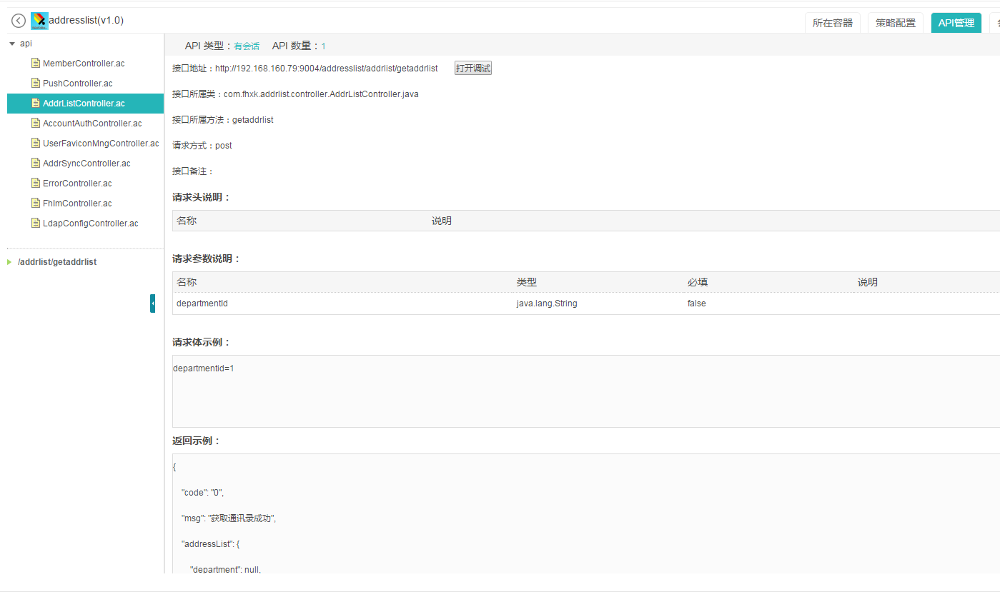

<h1>服务包介绍</h1>  

----------
ExMobi服务包必需遵循ExMobi服务包规范，开发者只有遵循ExMobi服务包规范开发的服务，才能在服务端正常运行，如果服务包不规范，将无法正常运行。

## 目录结构

服务目录结构：

	MyService      服务根目录
		| --- WEB-INF  整个WEB中最安全的目录，无法直接访问，若访问，需要在web.xml中配置
			|-- classes  保存所有的*.class文件	所有的class都要放在包中
				|-- config.xml服务参数配置文件，ExMobi管理端会自动读取该路径文件展示参数并支持动态配置
				|-- api(可选)用于存放API定义文件的目录，使用SpringMVC开发的服务，无需定义该目录及ac文件
				|-- api.ac(可选)API定义文件，服务端会解析这些文件并展示在API管理中
			|-- lib           存放第三方的jar文件
			|-- web.xml  WEB的部署描述文件
		|---   css  (可选)存放所有的*.css文件
		|---   js   (可选)存放所有的*.js文件
		|---   jsp  (可选)存放所有的jsp文件
		|---   index.jsp  (可选)欢迎页面

## 服务配置文件config.xml
服务参数配置文件（config.xml）ExMobi提供的统一格式的配置文件，开发者在该文件中定义具体业务依赖的配置项，exmobi-business.jar提供了ParamConfig类及参数读取api，支持服务读取相关配置项。config.xml文件中定义的配置信息，会自动在ExMobi管理中展示，并且支持动态修改配置值。

config.xml是服务与ExMobi管理端之间的桥梁，通过定义config.xml文件，可以做到参数定义统一配置，简化服务部署。

config.xml文件示例如下：

	<?xml version="1.0" encoding="UTF-8"?>
	<config>
		<group id="local" name="本地参数配置">
			<paralist>
				<param>
					<paraKey>api_key</paraKey>
					<paraValue>abzu862089doecoi2343242dfafd992</paraValue>
					<paraName>访问IM服务器API访问密钥</paraName>
					<paraMemo>访问IM服务器API访问密钥</paraMemo>
					<paraRule>^.*$</paraRule>
				</param>
			</paralist>
		</group>
	</config>

config.xml文件中主要配置项说明

<table>
<tr><th>Key值</th><th>类型</th><th>说明</th></tr>
<tr>
<td>groupId</td>
<td>属性</td>
<td>配置项组id</td>
</tr>
<tr>
<td>groupName</td>
<td>属性</td>
<td>配置项组名称</td>
</tr>
<tr>
<td>paraKey</td>
<td>节点</td>
<td>参数key值，该配置项的唯一key值，ParamConfig类需要根据该值获取到paraValue配置值</td>
</tr>
<tr>
<td>paraMemo</td>
<td>节点</td>
<td>参数配置示例，用于介绍该配置项的配置示例，ExMobi管理端会读取并显示该值</td>
</tr>
<tr>
<td>paraName</td>
<td>节点</td>
<td>参数名称，无特殊用途，ExMobi管理端会读取并显示该值</td>
</tr>
<tr>
<td>paraRule</td>
<td>节点</td>
<td>参数值定义正则规则，暂不生效</td>
</tr>
<tr>
<td>paraValue</td>
<td>节点</td>
<td>参数value值，ParamConfig类根据该paraKey值获取到的即是该值</td>
</tr>
</table>

## API定义和管理

上传到ExMobi平台上的服务，支持对服务中定义的一系列API进行统一管理，同时支持自动化生产调试页面，方便开发者对API进行调试。

ExMobi平台对上传上来的服务做了两中技术手段的区分，一种是基于SpringMVC技术开发的服务，一种是基于其他技术开发的服务，针对这2类服务，ExMobi都提供相应的方法，将服务与ExMobi平台建立互联机制，实现API自动化管理。

### SpringMVC技术开发
使用SpringMVC开发的服务，无需定义该目录及ac文件，只需在自己代码中增加相应的配置，即可在管理端的“API管理”页面中查看到API明细。

配置步骤：

1. 引入exmobi-mng-x.x.x.jar, exmobi-spring-x.x.x.jar
在服务中引入exmobi-mng-x.x.x.jar，exmobi-spring-x.x.x.jar及其依赖的相关jar文件。
2. web.xml中配置exmobi-mng能力的监听器

		<listener>
			<listener-class>com.fiberhome.commons.listener.MngListener</listener-class>
		</listener>
3. web.xml中配置springmvc的DispatcherServlet为自动启动

		<!--配置Springmvc核心控制器 -->
		<servlet>
			<servlet-name>spmvc</servlet-name>
			<servlet-class>org.springframework.web.servlet.DispatcherServlet</servlet-class>
			<load-on-startup>1</load-on-startup>
		</servlet>
		<!--为DispatcherServlet建立映射 -->
		<servlet-mapping>
			<servlet-name>spmvc</servlet-name>
			<url-pattern>*.do</url-pattern>
		</servlet-mapping>
4. springmvc-servlet.xml中增加CommonApplicationContext定义

基于SpringMVC开发，在web.xml中定义了DispatcherServlet，SpringMVC会根据servlet-name加载指定的配置文件，如servlet-name取值：spmvc，SpringMVC会自动加载与web.xml同路径下名为spmvc-servlet.xml的配置文件。

这里，我们需要在spmvc-servlet.xml文件中文件以下内容：

	<bean id="myContext"class="com.fiberhome.spring.apiinfo.CommonApplicationContext"/>

### 其他技术开发

基于其他技术开发的服务，如果希望在管理端的API管理中查看并调试API，需要自己配置API定义文件，API定义文件是以“ac”作为后缀名命名的文件，如：“test.ac”。API定义文件存放在MyService/WEB-INF/classes/api/目录下，详细请参考服务“[服务包介绍-目录结构](#cid_0)”章节。该目录下的ac文件，以API接口形式定义了服务的各种服务能力，API文件中定义的一系列接口，最终仍然会被转发到jsp目录下的处理页面中。

开发者可以将每个ac文件理解为一个模块，这个ac文件里面定义了某个模块下的一系列接口，开发者在一个服务的api目录下定义多个ac文件，实现整个服务不同模块的所有API的接口定义。

服务端同时API定义做了界面展示功能，开发者可以在管理端以界面化的形式查看API定义。

api文件定义示例：

	<?xmlversion="1.0"encoding="UTF-8"?>
	<maxml-api xmlns="http://www.nj.fiberhome.com.cn/map"
		xmlns:xsi="http://www.w3.org/2001/XMLSchema-instance"
		xsi:schemaLocation="http://www.nj.fiberhome.com.cn/map ../../../maxml-api-2.0.xsd">
		<apis id="addrListController" name="服务" isrest="true" desc="服务API" class="com.fhxk.addrlist.controller.AddrListController">
			<api uri="/service/getPerson.do" apimethod=" getPerson" name="getPersion" desc="获取人员信息" method="get">
				<headers>
					<header name="headername"desc="请求头"/>
				</headers>
				<params>
					<param type="String" name="username" required="true" desc="用户名"/>
					<param type="String" name="password" required="true" desc="密码"/>
				</params>
				<content><![CDATA[text]]></content>
				<succrsp><![CDATA[text]]></succrsp>
				<failrsp><![CDATA[text]]></failrsp>
			</api>
		</apis>
	</maxml-api>

<table>
   <tr>
      <td>元素</td>
      <td>父元素</td>
      <td>必选</td>
      <td>描述</td>
   </tr>
   <tr>
      <td>&lt;apis/&gt;</td>
      <td></td>
      <td>是</td>
      <td>API服务标签，其下定义一系列API组</td>
   </tr>
   <tr>
      <td>&lt;api/&gt;</td>
      <td>&lt;apis/&gt;</td>
      <td>是</td>
      <td>API定义标签，一个&lt;api/&gt;标签定义一个API接口</td>
   </tr>
   <tr>
      <td>id</td>
      <td>&lt;apis/&gt;</td>
      <td>否</td>
      <td>API分组id</td>
   </tr>
   <tr>
      <td>name</td>
      <td>&lt;apis/&gt;</td>
      <td>否</td>
      <td>API分组名词</td>
   </tr>
   <tr>
      <td>isrest</td>
      <td>&lt;apis/&gt;</td>
      <td>否</td>
      <td>API分组中的所有API的类型，定义是否是RestFul风格的API True：是 False：不是 缺省：不是</td>
   </tr>
   <tr>
      <td>desc</td>
      <td>&lt;apis/&gt;</td>
      <td>否</td>
      <td>API分组描述信息</td>
   </tr>
   <tr>
      <td>class</td>
      <td>&lt;apis/&gt;</td>
      <td>是</td>
      <td>Api实现类</td>
   </tr>
   <tr>
      <td>uri</td>
      <td>&lt;api/&gt;</td>
      <td>是</td>
      <td>以正则表达式匹配 API的url匹配地址</td>
   </tr>
   <tr>
      <td>apimethod</td>
      <td>&lt;api/&gt;</td>
      <td>是</td>
      <td>处理请求的函数</td>
   </tr>
   <tr>
      <td>name</td>
      <td>&lt;api/&gt;</td>
      <td>否</td>
      <td>API名称</td>
   </tr>
   <tr>
      <td>desc</td>
      <td>&lt;api/&gt;</td>
      <td>否</td>
      <td>API描述</td>
   </tr>
   <tr>
      <td>method</td>
      <td>&lt;api/&gt;</td>
      <td>否</td>
      <td>HTTP请求API的method GET/POST</td>
   </tr>
   <tr>
      <td>&lt;params/&gt;</td>
      <td>&lt;api/&gt;</td>
      <td>否</td>
      <td>API请求参数列表标签，该标签包含了一系列param子标签</td>
   </tr>
   <tr>
      <td>&lt;param/&gt;</td>
      <td>&lt;params/&gt;</td>
      <td>否</td>
      <td>API请求参数定义标签</td>
   </tr>
   <tr>
      <td>&lt;headers/&gt;</td>
      <td>&lt;api/&gt;</td>
      <td>否</td>
      <td>API请求头列表标签，该标签包含了一系列header子标签</td>
   </tr>
   <tr>
      <td>&lt;header/&gt;</td>
      <td>&lt;headers/&gt;</td>
      <td>否</td>
      <td>API请求头定义标签</td>
   </tr>
   <tr>
      <td>&lt;content/&gt;</td>
      <td>&lt;api/&gt;</td>
      <td>否</td>
      <td>API请求体定义标签</td>
   </tr>
   <tr>
      <td>&lt;succrsp/&gt;</td>
      <td>&lt;api/&gt;</td>
      <td>否</td>
      <td>API成功响应体定义标签</td>
   </tr>
   <tr>
      <td>&lt;failrsp/&gt;</td>
      <td>&lt;api/&gt;</td>
      <td>否</td>
      <td>API失败响应体定义标签</td>
   </tr>
   <tr>
      <td>type</td>
      <td>&lt;param/&gt;</td>
      <td>是</td>
      <td>API请求参数类型 取值：String, File String：字符串形式的数据 File：文件形式的数据</td>
   </tr>
   <tr>
      <td>name</td>
      <td>&lt;param/&gt;</td>
      <td>是</td>
      <td>API请求参数名称</td>
   </tr>
   <tr>
      <td>required</td>
      <td>&lt;param/&gt;</td>
      <td>是</td>
      <td>API请求参数是否必填，true：必填，false：非必填</td>
   </tr>
   <tr>
      <td>desc</td>
      <td>&lt;param/&gt;</td>
      <td>否</td>
      <td>API请求参数描述</td>
   </tr>
   <tr>
      <td>name</td>
      <td>&lt;header/&gt;</td>
      <td>是</td>
      <td>API请求头名称</td>
   </tr>
   <tr>
      <td>desc</td>
      <td>&lt;header/&gt;</td>
      <td>否</td>
      <td>API请求头描述</td>
   </tr>
   <tr>
      <td>isfile</td>
      <td>&lt;succrsp/&gt;</td>
      <td>否</td>
      <td>API的成功响应是否是附件 取值：true，false， 缺省，false true：是 false：否</td>
   </tr>
</table>
