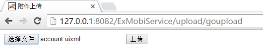
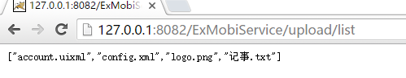

# 典型场景示例 

----------

<h2 id="cid_0">服务与业务系统会话维持</h2>  

场景描述：第三方web系统需要进行登录后方能进行后续的相关业务请求操作，这就要求后续的请求均需要采用第一次登录成功的会话，同时第三方web系统的会话时长有效期只有10分钟，如果登录后10分钟不继续访问该会话失效，再次访问需要重新登录。所以需要对该会话进行会话维持。  

从上面的场景可以得出服务和业务系统会话维持需要关注两个方面：  

1.会话上下文如何存储，确保每次均采用同一个上下文   

2.会话上下文如何保持不失效，对于第三方会话时长有效性比较长的可以不考虑该方面  

针对上述场景示例代码开发如下：  

```java
/**
 * web上下文的情况
 * @param session
 */
public void login(final HttpSession session)
{
	//初始构建上下文
	final HttpContext httpContext = new HttpContext();
	httpContext.setContextId(session.getId());
	
	// 后续请求均采用带有上下文的方式构建HttpUtil请求第三方业务系统
	HttpUtil httputil = new HttpUtil(httpContext);
	HttpResponseBean rsp = httputil.sendGet("http://127.0.0.1/oa/login.do?username=xxxx&password=xxxx");
	// 获取响应吗
	Int status = rsp.getStatusCode();
	// 获取响应头
	List<HttpHeader>rspheaders = rsp.getHeaders();
	// 获取响应类容
	String data = rsp.getResponseBody("utf-8");
	
	//判断登录成功，将上下文缓存到当前会话中，后续请求均采用会话中上下文
	if(status==200  &&null!=data&&data.indexOf("登录成功")>0)
	{
		//将当前上下文存储到会话中
		session.setAttribute("httpContext", httpContext);
		
		//心跳机制根据实际情况需要，如果第三方会话时长足够长，可不启动心跳机制
		//启动上下文心跳机制, 请确保心跳间隔时长小于第三方会话时长
//HttpContextHeartService见提供的example用例
		HttpContextHeartService.getSingleton().toHeart(new Runnable()
		{
			@Override
			publicvoid run()
			{
				try
				{
					HttpUtil httputil = new HttpUtil(httpContext);
					httputil.sendGet("http://127.0.0.1/oa/xxx.do");
				}
				catch (Exception e)
				{
					e.printStackTrace();
				}
			}
		}, 5, session);
	}
	
}
/**
 * 获取公共信息
 * @param session
 */
public void getGongGao(HttpSession session)
{
	//从当前会话中获取上下文
	HttpContext httpContext = (HttpContext)session.getAttribute("httpContext");
	
	//采用上下文进行请求第三方业务系统
	HttpUtil httputil = new HttpUtil(httpContext);
	HttpResponseBean rsp = httputil.sendGet("http://127.0.0.1/oa/login.do?username=xxxx&password=xxxx");
	// 获取响应吗
	Int status = rsp.getStatusCode();
	// 获取响应头
	List<HttpHeader>rspheaders = rsp.getHeaders();
	// 获取响应类容
	String data = rsp.getResponseBody("utf-8");
	System.out.println(status);
	System.out.println(rspheaders);
	System.out.println(data);
}

```  

<h2 id="cid_1">http请求完整请求信息设置</h2>  

前面几章的有关朝第三方业务系统发起http请求的示例代码里，http请求都非常简单，都是get请求，那么实际业务场景中，业务系统的http请求肯定不可能都是get请求这么简单，参数体、请求头、参数编码方式等都可能需要特别设置，针对此场景的示例代码：  

```java
public Object dologin(HttpServletRequest request,final HttpSession session,@RequestParam(required=true,value="username") String username,@RequestParam(required=true,value="password") String password)throws Exception{
		//初始构建上下文
		final HttpContext httpContext = new HttpContext();
		httpContext.setContextId(session.getId());
		// 后续请求均采用带有上下文的方式构建HttpUtil请求第三方业务系统
		//url中有特殊符号，HttpUtilWithOutEncode可使请求时不对url进行编码
		HttpUtilWithOutEncode httpUtil = new HttpUtilWithOutEncode(httpContext);
		HttpRequestBean req = new HttpRequestBean();
		//设置url
		String url = "http://"+ParamConfig.getValue("pathdomain")+"/path/SSO!login.action";
		req.setUrl(url);
		req.setEnctype(1);
		//设置请求头
		List<HttpHeader> headers = new ArrayList<HttpHeader>();
		headers.add(new HttpHeader("Content-Type", "application/x-www-form-urlencoded"));
		req.setHeaders(headers);
		//设置Method
		req.setMethod("POST");
		//设置请求参数
		List<FormParamter> params = new ArrayList<FormParamter>();
		params.add(new FormParamter("gourl", ""));
		params.add(new FormParamter("loginname", username));
		params.add(new FormParamter("password", password));
		req.setFormParams(params);
		
		//发起请求
		HttpResponseBean rsp = httpUtil.sendHttpRequest(req);
		// 获取响应吗
		int status = rsp.getStatusCode();
		//html转Dom文件
		Document dom = XmlUtil.html2xml(rsp.getResponseBody("UTF-8"));
		IXPathProcess ixp = new CachedDom4jXpathProcessImpl();
		Node sucNode = (Node)ixp.selectNode("//a[@id='my_task_list']", dom);
		JSONObject rspJson = new JSONObject();
		if(null != sucNode && status == 200){
			//将当前上下文存储到会话中
			session.setAttribute("httpContext", httpContext);
			rspJson.put("result", "success");
		}else{
			rspJson.put("result", "fail");
			rspJson.put("msg", "用户名或密码错误");
		}
		return rspJson;
	}

```  

<h2 id="cid_2">利用正则表达式抓取网页数据</h2>   

前面的http请求示例中，都是利用Xpath对网页内容转换后生成的Dom文件来进行数据抓取操作，和ExMobi5服务端相比，ExMobi6服务端的jar包仅对Xpath方法抓取页面信息有封装，而没有类似ExMobi5服务端那种封装了正则表达式的aa.regex函数集，因此，在ExMobi6里，我们需要利用java本身的正则表达式操作方法来从网页上抓取数据。  

示例代码如下：  

```java
@RequestMapping("/edu/regex")
	@ResponseBody
	public Object getEduListByRegex() throws Exception{
		HttpUtil httpUtil = new HttpUtil();
		String url = "https://edu.exmobi.cn/";
		HttpResponseBean rsp = httpUtil.sendGet(url);//发起http请求
		JSONObject rspJson = new JSONObject();
		JSONArray articlesArray = new JSONArray();
		if(rsp.getStatusCode() == 200){
			rspJson.put("result", "success");
			//替换网页源字符串中所有换行、制表、回车、报警符以方便正则替换
			String rspStr = rsp.getResponseBody("UTF-8").replaceAll("\\r|\\t|\\n|\\a", "");
			String regex = "<div class=\"col-xs-6 col-md-3 edit\">\\s*<a class=\"thumbnail\" href=\"([^\"]+)\">\\s*\\s*<div class=\"caption\">\\s*<h6>([^<]+)</h6>\\s*<h6 class=\"subhead\">([^<]+)</h6>\\s*<div>\\s*<span class=\"glyphicon glyphicon-user subhead-content\"></span>\\s* <span class=\"subhead-content\">([^<]+)</span>\\s*<span style=\"float:right;color:#bbb;font-size:12px;margin-top:3px;\">([^<]+)</span>\\s*</div>\\s*</div>\\s*</a>\\s*</div>";
			Pattern p = Pattern.compile(regex);
			Matcher matcher = p.matcher(rspStr.replaceAll("\\r|\\t|\\n|\\a", ""));
			while(matcher.find()){
				JSONObject article = new JSONObject();
				article.put("title", matcher.group(4).trim());
				article.put("content", matcher.group(5).trim());
				article.put("href", matcher.group(1).trim());
				article.put("img", matcher.group(3).trim());
				articlesArray.add(article);
			}
			rspJson.put("articles", articlesArray);
		}else{
			rspJson.put("result", "fail");
			rspJson.put("msg","业务系统响应异常，请联系管理员");
		}
		return rspJson;
	}

```

<h2 id="cid_3">附件上传示例</h2>  

附件上传是web系统开发中常见的业务场景，和ExMobi5服务端不同，ExMobi6服务端提供的jar包内，不再封装有类似aa.req这样能够解析出请求者提交的所有http请求信息的类，回顾前面的http请求相关示例，取http请求信息都是利用Spring自身的请求机制实现的。那么，附件上传也是一样，请参考以下的示例。  

我们利用SpringMVC的文件上传解析器来实现附件上传功能。首先在工程中引入附件上传所需的jar包：commons-loggin-*.jar和commons-fileupload-*.jar。 

在SpringMVC的配置文件（mvc-config.xml）里配置文件解析器：  

```xml
<!-- 文件解析bean -->
<bean id="multipartResolver" class="org.springframework.web.multipart.commons.CommonsMultipartResolver">
	<property name="defaultEncoding" value="utf-8"></property>
	<property name="maxUploadSize" value="10485760000" />  
    <property name="maxInMemorySize" value="40960" />  
</bean>

```

实现接收附件信息的API ，在com.fh.demo.controller包下建立“UploadController.java”文件：  

```java

package com.fh.demo.controller;

import java.io.File;
import java.io.IOException;

import javax.servlet.http.HttpServletRequest;

import org.springframework.stereotype.Controller;
import org.springframework.ui.Model;
import org.springframework.web.bind.annotation.RequestMapping;
import org.springframework.web.bind.annotation.RequestMethod;
import org.springframework.web.bind.annotation.RequestParam;
import org.springframework.web.bind.annotation.ResponseBody;
import org.springframework.web.multipart.commons.CommonsMultipartFile;

@Controller
@RequestMapping("/upload")
public class UploadController {

	@RequestMapping("/goupload")
	public String goUploadPage(Model model){
		return "fileUpload";
	}
	
	/**
	 * 附件上传
	 * @param model
	 * @param file
	 * @param request
	 * @return
	 * @throws Exception
	 */
	@RequestMapping(value="/doupload", method = RequestMethod.POST)
	public String fileUpload(Model model,@RequestParam(required=true,value="file") CommonsMultipartFile file,HttpServletRequest request) throws Exception{
		// 获取文件类型  
        System.out.println(file.getContentType());  
        // 获取文件大小  
        System.out.println(file.getSize());  
        // 获取文件名称  
        System.out.println(file.getOriginalFilename());  
        // 判断文件是否存在  
        if (!file.isEmpty()) {  
        	// 文件保存路径  
//            String path = request.getSession().getServletContext().getRealPath("/") + "upload/"  
//                    + file.getOriginalFilename();  
            String path = "D:/file/temp/" + file.getOriginalFilename();  
            File localFile = new File(path);  
            try {  
                file.transferTo(localFile);  
            } catch (IllegalStateException e) {  
                e.printStackTrace();  
            } catch (IOException e) {  
                e.printStackTrace();  
            }  
        }  
        return "redirect:/upload/list";
	}
	
	 /*** 
     * 读取上传文件中得所有文件并返回 
     *  
     * @return 
     */  
    @RequestMapping("/list")  
    @ResponseBody
    public Object list(HttpServletRequest request) {  
//        String filePath = request.getSession().getServletContext().getRealPath("/") + "upload/";  
        String filePath = "D:/file/temp";  
        File uploadDest = new File(filePath);  
        String[] fileNames = uploadDest.list();  
        
        for (int i = 0; i < fileNames.length; i++) {  
            //打印出文件名  
            System.out.println(fileNames[i]);  
        }  
        return fileNames;  
    }  
}

```

在工程的WEB-INF/views目录下新建一个JSP叫“fileUpload”，作为上传附件的视图JSP页面测试下：  

```html
<%@ page language="java" contentType="text/html; charset=UTF-8"
    pageEncoding="UTF-8"%>
<!DOCTYPE html PUBLIC "-//W3C//DTD HTML 4.01 Transitional//EN" "http://www.w3.org/TR/html4/loose.dtd">
<html>
<head>
<meta http-equiv="Content-Type" content="text/html; charset=UTF-8">
<title>附件上传</title>
</head>
<body>
<form action="doupload" method="post" enctype="multipart/form-data">  
        <input type="file" name="file" />  
        <input type="submit" value="上传" />  
    </form>  
</body>
</html>

```

在浏览器上访问测试下：  

  

  

